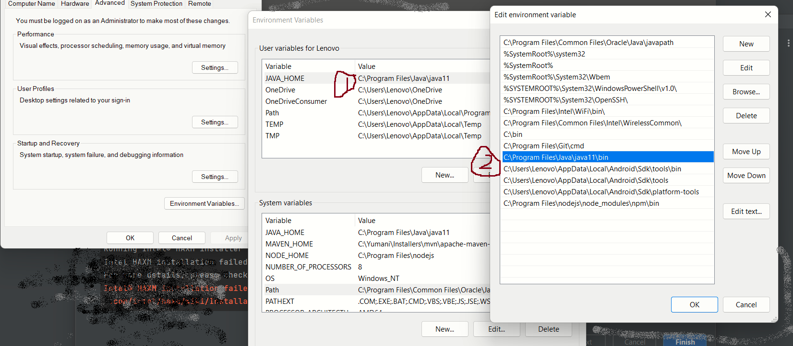
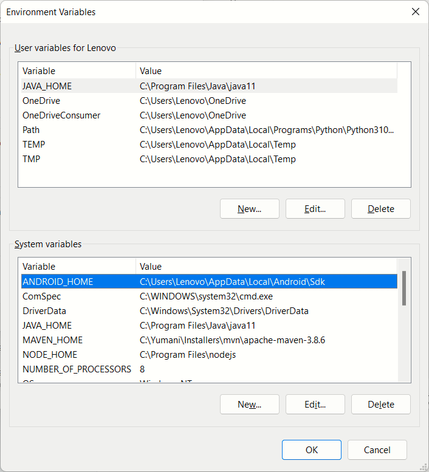
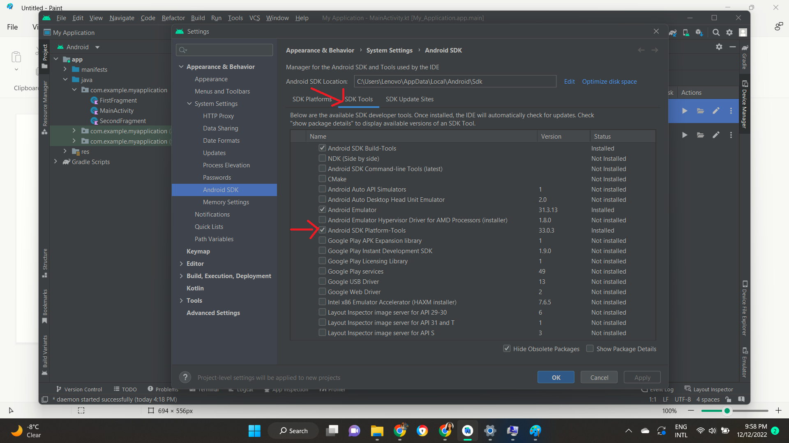

# Install Pre-requisite software

Lets download these software and add their paths to global variables of our environment

#### Java

Download JDK 11 and install it in environment. &#x20;

1. Configure JAVA\_HOME environment variable -  i.e. JAVA\_HOME pointing to \<Path to java installation>

2\.   Update systems path - i.e. update the "Path" variable under "Systems Variables" to have \<Path to java installation>/bin

<figure><figcaption></figcaption></figure>

#### Android Studio

Download Android-SDK LTS from their website and install in your environment&#x20;

1. Once installed copy the home directory path of Andriod SDK. Usually its C:\Users\\\<suername>\AppData\Local\Android\Sdk and create ANDROID\_HOME system variable&#x20;

<figure><figcaption></figcaption></figure>

2\.  Also we add below to the path variable

* C:\Users\\\<username>\AppData\Local\Android\Sdk\tools\bin
* C:\Users\\\<username>\AppData\Local\Android\Sdk\tools
* C:\Users\\\<username>\AppData\Local\Android\Sdk\platform-tools

Above tools directory will not appear in our file system until Andriod Studio is built. For that

* Launch Android Studio SDK (ANDRIOD\_HOME/bin/studio64/), and create a new application. It will load the application perspective.&#x20;
* Once the loading is completed, Click on Tools > SDK Manager > Select "SDK Tools" tab >tick "Android SDK Platform-Tools"

<figure><figcaption></figcaption></figure>

#### node.js

Download and install Node.js and you need to setup system variables just like you did for other 2 software.

1. Create NODE\_HOME system variable and point it to the node.js location in Program Files. i.e. NODE\_HOME=C:\Program Files\nodejs
2. Add npm directory to the "Path" variable. i.e. C:\Program Files\nodejs\node\_modules\npm\bin
